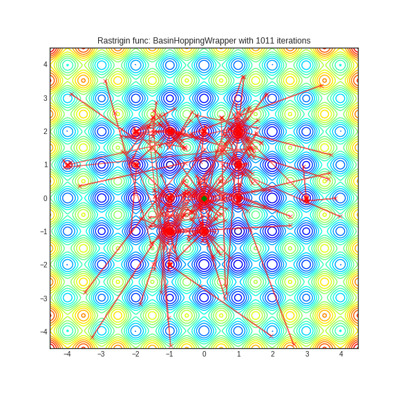
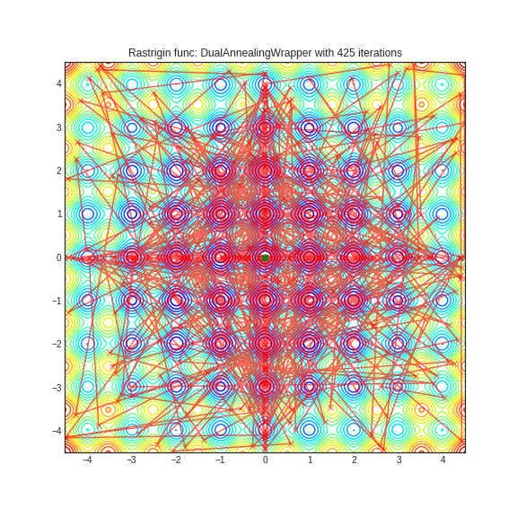
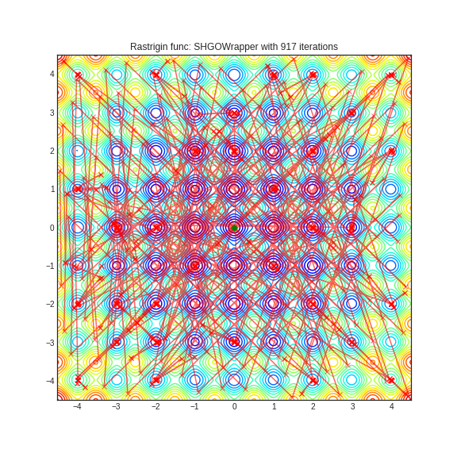

PyTorch Minimize
================

[](https://travis-ci.com/gngdb/pytorch-minimize)

A wrapper for [`scipy.optimize.minimize`][scipy] to make it a PyTorch
Optimizer implementing Conjugate Gradients, BFGS, l-BFGS, SLSQP, Newton
Conjugate Gradient, Trust Region methods and others in PyTorch.

*Warning*: this project is a proof of concept and is not necessarily
reliable, although [the code](./pytorch_minimize/optim.py) (that's all of
it) is small enough to be readable.

* [Quickstart](#quickstart)
  * [Install](#install)
  * [Using The Optimizer](#using-the-optimizer)
* [Which Algorithms Are Supported?](#which-algorithms-are-supported)
  * [Methods that require Hessian evaluations](#methods-that-require-hessian-evaluations)
  * [Algorithms without gradients](#algorithms-without-gradients)
  * [Algorithms you can choose but don't work](#algorithms-you-can-choose-but-dont-work)
* [Global Optimizers](#global-optimizers)
* [How Does it Work?](#how-does-it-work)
  * [Other Implmentations](#other-implementations)
* [How Does This Evaluate the Hessian?](#how-does-this-evaluate-the-hessian)
* [Credits](#credits)

Quickstart
----------

### Install

Dependencies:

* `pytorch`
* `scipy`

The following install procedure isn't going to check these are installed.

This package can be installed with `pip` directly from Github:

``` 
pip install git+https://github.com/gngdb/pytorch-minimize.git
```

Or by cloning the repository and then installing:

```
git clone https://github.com/gngdb/pytorch-minimize.git
cd pytorch-minimize
python -m pip install .
```

### Using The Optimizer

The Optimizer class is `MinimizeWrapper` in `pytorch_minimize.optim`.  It
has the same interface as a [PyTorch Optimizer][optimizer], taking
`model.parameters()`, and is configured by passing a dictionary of
arguments, here called `minimizer_args`, that will later be passed to
[`scipy.optimize.minimize`][scipy]:

```
from pytorch_minimize.optim import MinimizeWrapper
minimizer_args = dict(method='CG', options={'disp':True, 'maxiter':100})
optimizer = MinimizeWrapper(model.parameters(), minimizer_args)
```

The main difference when using this optimizer as opposed to most PyTorch
optimizers is that a [closure][] ([`torch.optim.LBFGS`][torch_lbfgs] also
requires this) must be defined:

```
def closure():
    optimizer.zero_grad()
    output = model(input)
    loss = loss_fn(output, target)
    loss.backward()
    return loss
optimizer.step(closure)
```

This optimizer is intended for **deterministic optimisation problems**,
such as [full batch learning problems][batch]. Because of this,
`optimizer.step(closure)` should only need to be called **once**. 

Can `.step(closure)` be called more than once? Technically yes, but it
shouldn't be necessary because multiple steps are run internally up to the
`maxiter` option in `minimizer_args` and multiple calls are not
recommended. Each call to `optimizer.step(closure)` is an independent
evaluation of `scipy.optimize.minimize`, so the internal state of any
optimization algorithm will be interrupted.

[torch_lbfgs]: https://pytorch.org/docs/stable/optim.html#torch.optim.LBFGS


Which Algorithms Are Supported?
-------------------------------

Using PyTorch to calculate the Jacobian, the following algorithms are
supported:

* [Conjugate Gradients][conjugate]: `'CG'`
* [Broyden-Fletcher-Goldfarb-Shanno (BFGS)][bfgs]: `'BFGS'` 
* [Limited-memory BFGS][lbfgs]: `'L-BFGS-B'` but **requires double precision**:
    * `nn.Module` containing parameters must be cast to double, example:
`model = model.double()`
* [Sequential Least Squares Programming][slsqp]: `'SLSQP'`
* [Truncated Newton][tnc]: `'TNC'` but **also requires double precision**

The method name string is given on the right, corresponding to the names
used by [scipy.optimize.minimize][scipy].

### Methods that require Hessian evaluations

**Warning**: this is experimental and probably unpredictable.

To use the methods that require evaluating the Hessian, a `Closure` object
with the following methods is required (full MNIST example
[here](./mnist/hessian_logistic_regression.py)):

```
class Closure():
    def __init__(self, model):
        self.model = model
    
    @staticmethod
    def loss(model):
        output = model(data)
        return loss_fn(output, target) 

    def __call__(self):
        optimizer.zero_grad()
        loss = self.loss(self.model)
        loss.backward()
        return loss
closure = Closure(model)
```

The following methods can then be used: 

* [Newton Conjugate Gradient](https://youtu.be/0qUAb94CpOw?t=30m41s): `'Newton-CG'`
* [Newton Conjugate Gradient Trust-Region][trust]: `'trust-ncg'`
* [Krylov Subspace Trust-Region][krylov]: `'trust-krylov'`
* [Nearly Exact Trust-Region][trust]: `'trust-exact'`
* [Constrained Trust-Region][trust]: `'trust-constr'`

The code contains hacks to make it possible to call
[torch.autograd.functional.hessian][torchhessian] (which is itself only
supplied in PyTorch as beta).

### Algorithms without gradients

If using the `scipy.optimize.minimize` algorithms that don't require
gradients (such as `'Nelder-Mead'`, `'COBYLA'` or `'Powell'`), ensure that
`minimizer_args['jac'] = False` when instancing `MinimizeWrapper`.

### Algorithms you can choose but don't work

Two algorithms I tested didn't converge on a toy problem or hit errors.
You can still select them but they may not work:

* [Dogleg][]: `'dogleg'`

All the other methods that require gradients converged on a toy problem
that is tested in Travis-CI.

Global Optimizers
-----------------

There are a few [global optimization algorithms in
`scipy.optimize`][global]. The following are supported via their own
wrapper classes:

* Basin Hopping via `BasinHoppingWrapper`
* Differential Evolution via `DifferentialEvolutionWrapper`
* Simplicial Homology Global Optimization via `SHGOWrapper`
* Dual Annealing via `DualAnnealingWrapper`

An example of how to use one of these wrappers:

```
from pytorch_minimize.optim import BasinHoppingWrapper
minimizer_args = dict(method='CG', options={'disp':True, 'maxiter':100})
basinhopping_kwargs = dict(niter=200)
optimizer = BasinHoppingWrapper(model.parameters(), minimizer_args, basinhopping_kwargs)
```

These are also illustrated in [this colab notebook][colab], where the
following plots were generated:








[colab]: https://colab.research.google.com/drive/19hZSxw3ZT3IgWGD9ZOuOYryeJoOGenJU?usp=sharing
[global]: https://docs.scipy.org/doc/scipy/reference/optimize.html#global-optimization

How Does it Work?
-----------------

[`scipy.optimize.minimize`][scipy] is expecting to receive a function `fun` that
returns a scalar and an array of gradients the same size as the initial
input array `x0`. To accomodate this, `MinimizeWrapper` does the following:

1. Create a wrapper function that will be passed as `fun`
2. In that function:
    1. Unpack the umpy array into parameter tensors
    2. Substitute each parameter in place with these tensors
    3. Evaluate `closure`, which will now use these parameter values
    4. Extract the gradients
    5. Pack the gradients back into one 1D Numpy array
    6. Return the loss value and the gradient array

Then, all that's left is to call `scipy.optimize.minimize` and unpack the
optimal parameters found back into the model.

This procedure involves unpacking and packing arrays, along with moving
back and forth between Numpy and PyTorch, which may incur some overhead. I
haven't done any profiling to find out if it's likely to be a big problem
and it completes in seconds when optimizing a logistic regression on MNIST
by conjugate gradients.

### Other Implementations

There are a few other projects that incorporate `scipy.optimize` and
pytorch:

* [This gist][mygist] I wrote in 2018 then forgot about creates an
Objective object to pass into `scipy.optimize` but packs the arrays and
gradients in approximately the same way.
* [botorch's `gen_candidates_scipy`][botorch] wraps
`scipy.optimize.minimize` and uses it to optimize acquisition functions as
part of Bayesian Optimization.
* [autograd-minimize][agmin] wraps the `minimize` function itself, allowing
PyTorch or Tensorflow objectives to be passed directly to a function with
the same interface as `scipy.optimize.minimize`.

[agmin]: https://github.com/brunorigal/autograd-minimize
[botorch]: https://github.com/pytorch/botorch/blob/main/botorch/generation/gen.py
[mygist]: https://gist.github.com/gngdb/a9f912df362a85b37c730154ef3c294b

How Does This Evaluate the Hessian?
-----------------------------------

To evaluate the Hessian in PyTorch,
[`torch.autograd.functional.hessian`][torchhessian] takes two arguments:

* `func`: function that returns a scalar
* `inputs`: variables to take the derivative wrt

In most PyTorch code, `inputs` is a list of tensors embedded as parameters
in the Modules that make up the `model`. They can't be passed as `inputs`
because we typically don't have a `func` that will take the parameters as
input, build a network from these parameters and then produce a scalar
output.

From a [discussion on the PyTorch forum][forum] the only way to calculate
the gradient with respect to the parameters would be to monkey patch
`inputs` into the model and then calculate the loss. I wrote a [recursive
monkey patch][monkey] that operates on a [deepcopy][] of the original
`model`.  This involves copying everything in the model so it's not very
efficient.

The function passed to `scipy.optimize.minimize` as `hess` does the
following:

1. [`copy.deepcopy`][deepcopy] the entire `model` Module
2. Input `x` is a Numpy array so cast it to tensor float32 and
`require_grad`
3. Define a function `f` that unpacks this 1D Numpy array into parameter
tensors
    * [Recursively navigate][re_attr] the module object
        - Deleting all existing parameters
        - Replacing them with unpacked parameters from step 2
    * Calculate the loss using the static method stored in the `closure` object
5. Pass `f` to `torch.autograd.functional.hessian` and `x` then cast the
result back into a Numpy array

Credits
-------

If you use this in your work, please cite this repository using the
following Bibtex entry, along with [Numpy][numpycite], [Scipy][scipycite]
and [PyTorch][pytorchcite].

```
@misc{gray2021minimize,
  author = {Gray, Gavin},
  title = {PyTorch Minimize},
  year = {2021},
  publisher = {GitHub},
  journal = {GitHub repository},
  howpublished = {\url{https://github.com/gngdb/pytorch-minimize}}
}
```

This package was created with [Cookiecutter][] and the
[`audreyr/cookiecutter-pypackage`][audreyr] project template.

[pytorchcite]: https://github.com/pytorch/pytorch/blob/master/CITATION
[numpycite]: https://www.scipy.org/citing.html#numpy
[scipycite]: https://www.scipy.org/citing.html#scipy-the-library
[re_attr]: https://stackoverflow.com/a/31174427/6937913 
[deepcopy]: https://docs.python.org/3/library/copy.html#copy.deepcopy
[monkey]: https://github.com/gngdb/pytorch-minimize/blob/master/pytorch_minimize/optim.py#L106-L122
[forum]: https://discuss.pytorch.org/t/using-autograd-functional-jacobian-hessian-with-respect-to-nn-module-parameters/103994/3
[dogleg]: https://en.wikipedia.org/wiki/Powell%27s_dog_leg_method
[tnc]: https://en.wikipedia.org/wiki/Truncated_Newton_method
[krylov]: https://epubs.siam.org/doi/abs/10.1137/1.9780898719857.ch5
[trust]: https://en.wikipedia.org/wiki/Trust_region
[torchhessian]: https://pytorch.org/docs/stable/autograd.html#torch.autograd.functional.hessian
[slsqp]: https://en.wikipedia.org/wiki/Sequential_quadratic_programming
[conjugate]: https://en.wikipedia.org/wiki/Conjugate_gradient_method
[lbfgs]: https://en.wikipedia.org/wiki/Limited-memory_BFGS
[bfgs]: https://en.wikipedia.org/wiki/Broyden%E2%80%93Fletcher%E2%80%93Goldfarb%E2%80%93Shanno_algorithm
[batch]: https://towardsdatascience.com/batch-mini-batch-stochastic-gradient-descent-7a62ecba642a
[closure]: https://pytorch.org/docs/stable/optim.html#optimizer-step-closure
[optimizer]: https://pytorch.org/docs/stable/optim.html
[scipy]: https://docs.scipy.org/doc/scipy/reference/generated/scipy.optimize.minimize.html
[Cookiecutter]: https://github.com/audreyr/cookiecutter
[audreyr]: https://github.com/audreyr/cookiecutter-pypackage

